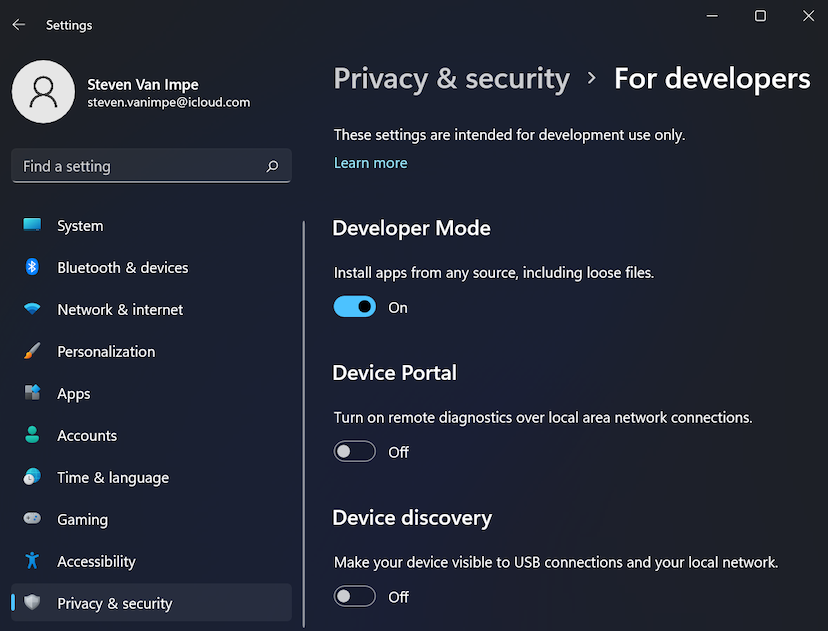

# Windows 10 / 11

The following instructions will help you get started with Swift on Windows.

## Prerequisites

Before you install Swift, first enable **developer mode**. This is required for the Swift Package Manager to work properly.

On Windows 10, open the **Start** menu and navigate to **Settings ▸ Update & Security ▸ For developers**. Here, you can enable developer mode:


On Windows 11, you can find this setting under **Settings ▸ Privacy & security ▸ For developers**:



Next, install or update **[App Installer](https://apps.microsoft.com/detail/9nblggh4nns1?hl=en-US&gl=BE)** from the Microsoft Store:


This will make sure you have the Windows Package Manager (**winget**) installed.

## Dependencies

Open **Command Prompt** or **Windows Terminal** and install Git and Python with the following commands:

```
winget install Git.Git
winget install Python.Python.3.9
```

Now restart your terminal and run the following commands: 

```
python -m ensurepip
python -m pip install six
```

These commands will install the Python package installer (**pip**) and compatibility library (**six**), or report that you already have them installed.

Next, install some required components from [**Visual Studio 2022**](https://visualstudio.microsoft.com), which is Microsoft’s IDE for development on Windows. Although you won’t use Visual Studio to develop Swift applications, you’ll need some of the tools and libraries that come with it.

Run the following command (all on one line):

```
winget install Microsoft.VisualStudio.2022.Community --force --custom "--add Microsoft.VisualStudio.Component.Windows11SDK.22000 --add Microsoft.VisualStudio.Component.VC.Tools.x86.x64"
```

## Swift

With these dependencies in place, you can now install Swift with the following command:

```
winget install Swift.Toolchain
```

Restart your terminal one last time, then verify that you can run the following command:

```
swift --version
```

## Known issues

- The REPL is currently unavailable on Windows ([#13804](https://bugs.swift.org/browse/SR-13804)).
- Running source files with `swift` is currently unavailable on Windows ([#13805](https://bugs.swift.org/browse/SR-13805)).
- Unicode output may not display properly on the command line.

---

Last updated: 6 Oct. 2023 \
Authors: [Saleem Abdulrasool](https://github.com/compnerd), [Steven Van Impe](https://github.com/svanimpe)
